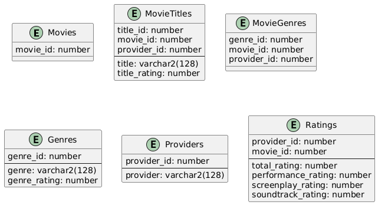
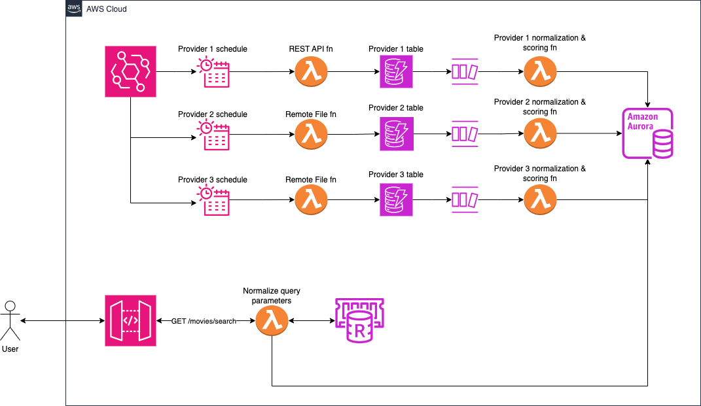

# C-Movie movie rating aggregation platform
Exercise asks to create a design to implement an aggregation platform for movie scores.

## Requirements
- Data ingestion needs to be done from multiple Data sources.
- Data is heterogeneous in nature. Each platform defines its own genres and ways of scoring. A normalization process is needed.
- Data sources are offline and online.
- Data needs to be accessible through a REST API.

## Assumptions
- Data sources are known and don't have to be dynamically added. In order to add a new data source some measure of coding needs to be done to include the new process.
- Data ingestion happens at intervals defined previously and ingestion tasks can be accommodated to run. No realtime ingestion is done.
- A process exists to score a given title given some parameters as well as the movie categories.

## Issues to solve
### Data Heterogeneousness
Since data is different for each of the providers, a normalization process is required to finally store the definitive data to a central store.

This normalization process can be done in a streaming fashion by leveraging CDC-enabled processes, or by utilizing streaming services. If this is not desired a scheduled task can also process pending data in batches.

### Data Ingestion
Each source needs to define the way data is grabbed and implement a recurrent task that does so and stores the unnormalized data to an intermediate store before proceeding to normalize it. If using a streaming service this intermediate store would be that service.

### Most Reliable Source
The normalizing process can also take care of the scoring of title and genres. Keeping a score in the final relational score allows us to preserve all the data from different providers and only choose the most appropriate when searching for data.

### Data Serving
A REST API needs to be created that queries the final curated data to serve it to the final user. This API will query the final store only, so the data will be eventually consistent with the ingestion process.

## Design
The design consist in multiple steps for each of the part of the system.

### Ingestion phase
A set of tasks need to be created for each of the different ways of ingesting data. Typically we would need:
1. A task type that will gather data from a configured REST API.
2. A task type that will fetch a file from a remote location and it's able to process it.

Each task needs to be configured to run in the proper schedule. If using Python one can use Celery to set it up. Each of these tasks will dump the data in a separate store per provider. For this unstructured and unnormalized data we can use a NoSQL data store.

### Normalization phase
An ETL process is triggered on data being available on the providers' stores that take the data, sanitize it and load it to our central storage.

This process also takes care of matching each element to a current element in the database and scores the title and genres based on the scoring algorithm aforementioned. The data is then stored in the final data store created using teh following schema.



Ratings table is normalized using the c-rating algorithm.

### API Layer
An API layer is created by exposing a REST API serving a search endpoint

```
GET /movies/search?query={query}
```

Such query can include genres, as defined in the Genres table as well as by title.

#### Caching
Since the API layer will eventually query the application database and aggregate the scores per provider a high number of times per second it is advised that a caching layer is implemented.

Since flexible queries may be required, an Elasticache layer may be advisable, where an index can be updated with the pre-calculated total score per movie, as well as its genres and most appropriate title.

## Example HLD for AWS
Below is an example of how the architecture could look like utilizing AWS serverless resources.



The ingestion tasks are orchestrated by EventBridge schedules which run Lambda functions. Each type of ingestion is a parametrized Lambda function that can be reused across multiple providers.

The tasks would fetch data from source and dump it in its respective DynamoDB table per provider.

Each change in those tables would be streamed using DynamoDB streams to a different Lambda function that will run the normalization process and the scoring of titles/genres and generation of c-rating. This process will generate the structured data that will be stored in an Aurora DB instance.

On the client side, an API Gateway will expose the REST GET method that will invoke a Lambda function that normalizes the query parameter-based search and looks it up in an Elasticache resource. If it's a cache miss it will go to the database to find it store the resulting data in the cache for future reference.